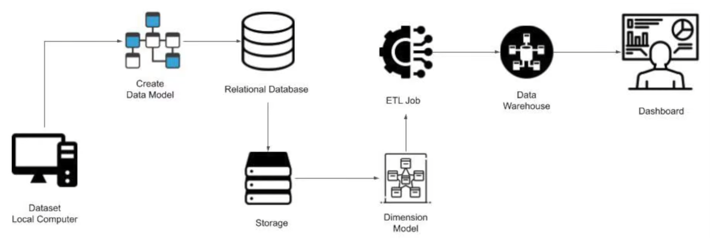
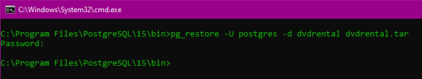
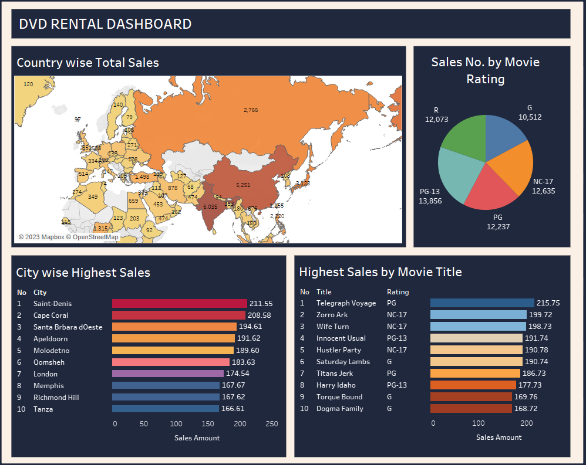

# Data Pipeline for DVD Rental Database
* This is a simple Data Pipeline created for DVD Rental database.
* In this data pipeline, the data comes from the local machine and travels through an architecture. At the end of this architecture we have a dashboard which can provide us insights from a large database.
* The aim of this architecture is to extract different insights from a large amount of data and make better data driven decisions for an organization.

  

* The database used in this pipeline is PostgreSQL
# Steps Perfomed
### 1] Creating database and loading data
* Creating the database
  * Execute create.py python script to create a database in PostgreSQL
* Loading the data
  * The data which have been used in this pipeline is present inside source directory.
  * For loading this data into a database go to the Postgres bin directory and execute the following command.
  
     
    

      

      
      

    

  
  * [Note: postgres is the username & dvdrental is the database name]
* Once the data is loaded into a database, we can see the data model of the database.

  

  

    
  

  

### 2. Displaying information and performing ETL operations
* Display information
  * Execute ETL.py python script 
  * It will display the information of all the tables present inside a database.
  * The information displayed would be the name of the table, number of records present, data types of all columns.
  * After displaying all the information, it will perform ETL operations.
* ETL (Extract Transform Load)
  * In ETL, we first extract the data from the database and perform the transformation.
  * Before extracting and transforming we must first create a data model for the data warhouse. Following is a data model for the data warhouse:-
  
   
  

    

    
    

  

  
  * Now we can extract the values from the tables and insert them into new tables accordingly. The commands for all this operations are present in ETL.sql file.
### 3. Storing the result of ETL operations in a Data Warhouse
* Once we have extracted the data from the database and transformed it, it is important to store it into some place.
* The Data warhouse used in this pipeline is Postgres itself.
* Once we execute the ETL.py, it extract the data from database, perform transformation and store it back in the PostgreSQL. 
### 4. Exporting the data from Data Warhouse
* To export the data from the database to CSV file execute export.py script.
* Now we can use this CSV files for different purposes. I have used this CSV files to create a dashboard. 
### 5. Creating Dashboard
* With the help of the exported CSV files we can create dashboards. This dashboard can help us visualize the data and help us to make better decisions in the future.
* The dashboard has been created using Tableau.

  

# Future scope
* This architecture has some manual work. We can try to automate each and every step in the architecture.
* Executing this architecture on a local machine can be slow and time consuming for large amount of data. We can deploy this architecture on the cloud for fast computation.
* Following is the architecture of the data pipeline which we can implement using cloud:-

  

